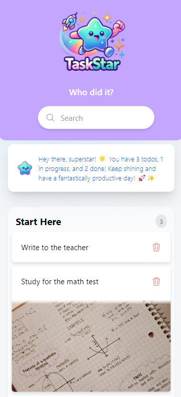
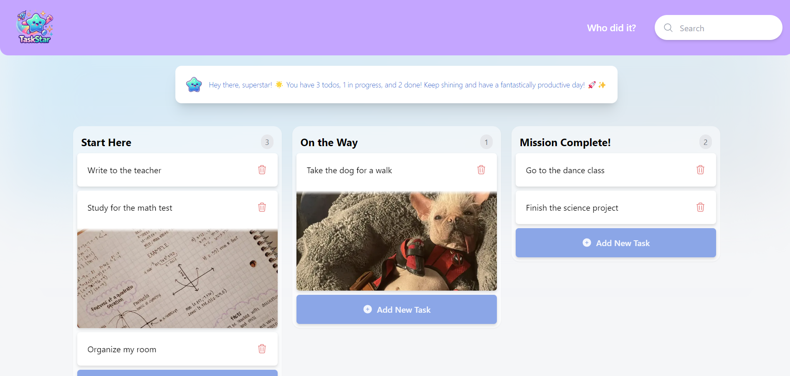

# TaskStar AI App 🌟

Welcome to the **TaskStar AI App**! This application was created to help children organize their tasks in a fun and intuitive way.

With the needs of children in mind, TaskStar offers a simple and colorful interface, allowing children to easily add, delete and search for their tasks. In addition, <u>with the help of ChatGPT's artificial intelligence</u>, the application generates automatic summaries of activities, encouraging children to learn to organize themselves from an early age in a light and interactive way.

## 🚀 Features

- **AI Summaries**: Using ChatGPT, the app generates summaries of tasks, giving kids an overview of what needs to be done.
- **Add Tasks**: Kids can quickly and easily add their daily tasks.
- **Delete Tasks**: Completed or unnecessary tasks can be removed with ease.
- **Search Tasks**: A search bar helps kids quickly find specific tasks.

## 📦 Technologies Used

- **[Next.js](https://nextjs.org/)**: React framework used for building the application.
- **[React.js](https://reactjs.org/)**: JavaScript library for building user interfaces.
- **[TailwindCSS](https://tailwindcss.com/)**: Used for responsive and efficient styling.
- **[Appwrite](https://appwrite.io/)**: Backend as a service for authentication and database.
- **[OpenAI API](https://openai.com/api/)**: Integration with ChatGPT API for generating automatic summaries.
- **[Zustand](https://zustand-demo.pmnd.rs/)**: Lightweight and intuitive state management for React.
- **[React Beautiful DnD](https://github.com/atlassian/react-beautiful-dnd)**: To create drag-and-drop interfaces.
- **[React Confetti](https://github.com/alampros/react-confetti)**: Adds a celebratory touch when tasks are completed.

## 🤖 Artificial Intelligence

The app uses OpenAI's API to integrate ChatGPT's artificial intelligence, which assists in creating automatic summaries of tasks. This feature aims to encourage children to reflect on their activities and develop a critical and organized mindset.

## 🛠️ Development

Linter: The project uses ESLint to keep the code clean and organized.
Typescript: Used to provide a safer development environment with static typing.

## 🎨 Interface

TaskStar's interface is designed with pastel colors and interactive elements to make the user experience enjoyable and appropriate for children.

## 📚 How to Run the Project

1. **Clone the repository**:

   ```bash
   git clone https://github.com/your-username/taskstar-ai-app.git
   cd taskstar-ai-app

   ```

2. **Install dependencies**:

   ```bash
   npm install

   ```

3. **Run the application in development mode**:

   ```bash
   npm run dev

   ```

4. **Build the project for production**:

   ```bash
   npm run build

   ```

5. **Start the server:**:
   ```bash
   npm start
   ```

## 🖥️ Demo

<br>

<p align="center">
  <a href="taskstar-ai.vercel.app" target="_blank">
  <br>
  <br><br>
  This project is deployed in Vercel, check it out by clicking on this link!
  </a>
</p>

<br>
<br>

<p align="center">
<a href="/LICENSE">MIT License</a> - Copyright © 2023 - <a href="https://github.com/thaixjacob">Thais Jacob</a>
</p>
